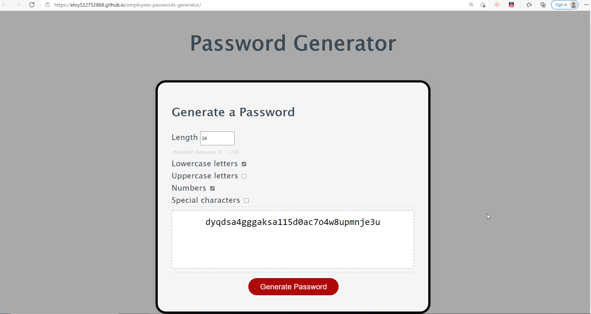

# portfolio-from-scratch
## Description
In this project I have created a Password Generator. The application enables employees to generate random passwords based on criteria that they’ve selected. This runs in the browser and will feature dynamically updated HTML and CSS powered by JavaScript code. Hope you have fun playing!!!

## Deployed Site
deployed site below:

[Deployed Site](https://eloy522752868.github.io/employees-passwords-generator/)